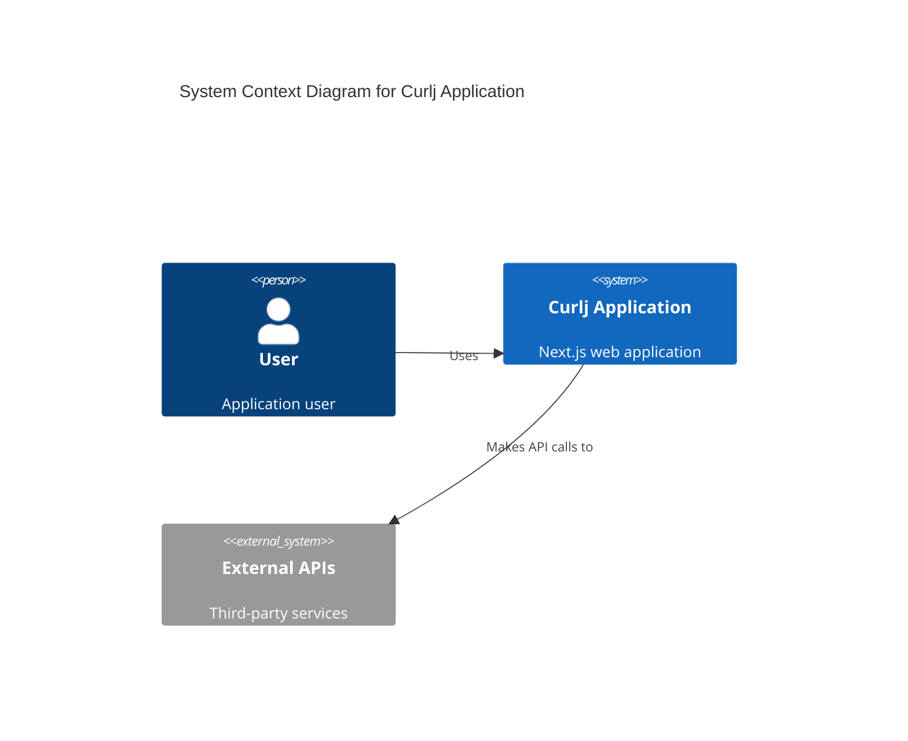
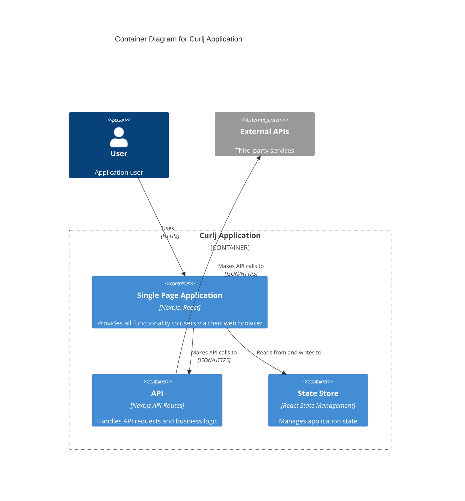
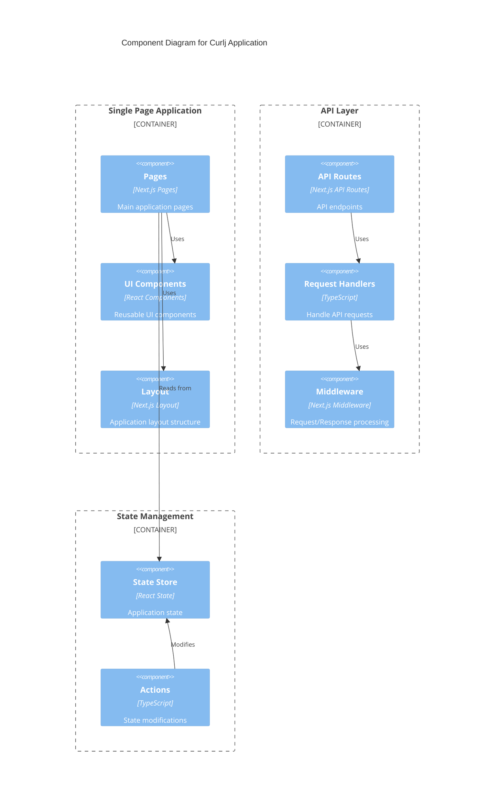

# C4 Model - Curlj Application

## System Context Diagram



## Container Diagram



## Component Diagram



## Code Level Diagram

```mermaid
C4Code
    title Code Level Diagram for Key Components

    Boundary(ui, "UI Layer") {
        Class(page, "Page Component")
        Class(component, "UI Component")
    }

    Boundary(logic, "Business Logic") {
        Class(handler, "Request Handler")
        Class(service, "Service")
    }

    Boundary(state, "State Management") {
        Class(store, "Store")
        Class(action, "Action")
    }

    Rel(page, component, "uses")
    Rel(page, handler, "calls")
    Rel(handler, service, "uses")
    Rel(page, store, "subscribes to")
    Rel(action, store, "updates")
```
