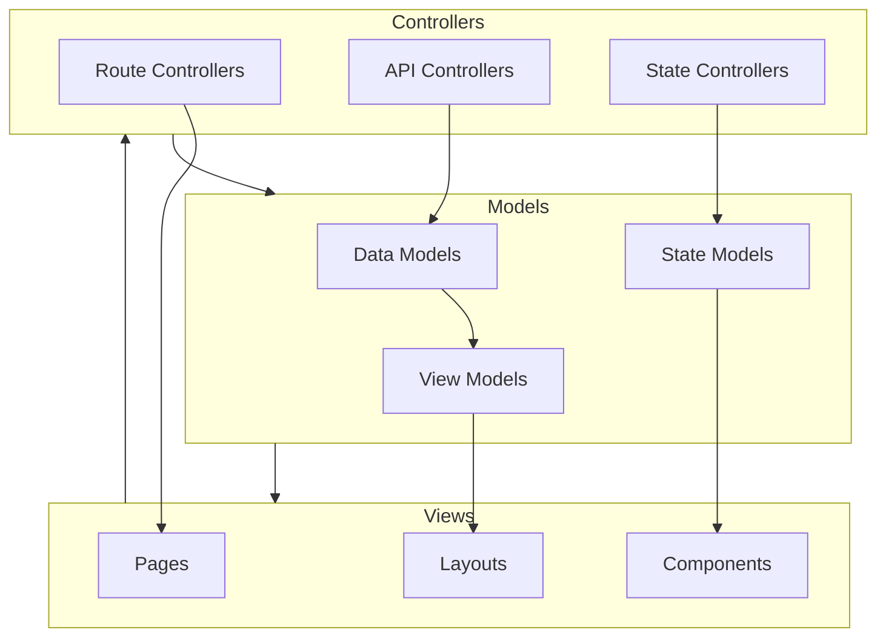

# Model-View-Controller (MVC) Architecture

## Overview
This document outlines the MVC architecture of the Curlj application.

## Architecture Components

### Models
- **Data Models**: Type definitions and interfaces
- **State Models**: Application state management
- **View Models**: UI state and data transformations

### Views
- **Pages**: Next.js page components
- **Components**: Reusable UI components
- **Layouts**: Page layouts and templates

### Controllers
- **Route Controllers**: Next.js API routes and page routing
- **API Controllers**: External API interactions
- **State Controllers**: State management logic

## Implementation Details

### Model Layer
- Located in `src/types/`
- Handles data structure definitions
- Manages application state

### View Layer
- Located in `src/app/` and `src/components/`
- Implements UI components
- Handles user interactions

### Controller Layer
- Located in `src/app/api/`
- Manages routing logic
- Handles API requests
